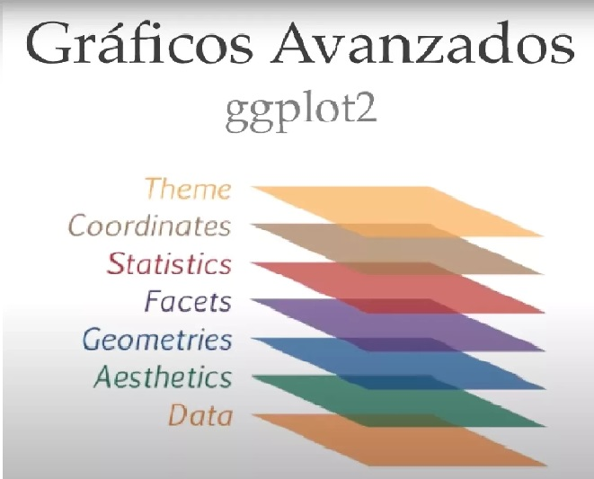

```{r setup, include=FALSE}
knitr::opts_chunk$set(echo = FALSE)
library(rio)
library(xlsx)
library(haven)
library(readxl)
library(foreign)
library(DataExplorer)
library(ggplot2)
library(tidyverse)
library(dplyr)
load("EV.Rdata")

```

## Taller: Análisis de datos con R

- Importación y exportación de datos con R 
- Introducción al análisis de datos con R
- Introducción a gráficos estadísticos con R


## Pausa para instalar las librerías

```{r , echo = TRUE,eval = F}
install.packages("DataExplorer")
install.packages("tidyverse")
install.packages("haven")
install.packages("readxl")
install.packages("rio")

library(rio)
library(haven)
library(readxl)
library(DataExplorer)
library(ggplot2)
library(tidyverse)

```


## R en la importación y exportación de datos


R es actualmente uno de los lenguajes más utilizados para el manejo, análisis y visualización de los datos en todo el mundo, esto debido a sus grandes ventajas, una de ella ser un software libre en la que expertos de diversos temas utilizan a R como una herramienta para sus investigaciones y desarrollos. 

Debido a los diferentes usos que tiene R en la actualidad, y a la comunidad que es bastante grande y activa, han permitido crear una variedad funciones para importar y exportar datos no solo de otros softwares ya conocidos como Stata, SPSS o Excel si no ya de herramientas más especializadas etc.

## R en el análisis de datos

Año tras año R sigue aumentando el número de librería en distintos temas, uno de ellos es el análisis de datos. R posee un lenguaje de programación bien desarrollado, simple y efectivo, que incluye condicionales, ciclos, funciones recursivas y posibilidad de entradas y salidas. (Debe destacarse que muchas de las funciones suministradas con el sistema están escritas en
el lenguaje R)

Esta facilidad hacen de R una herramienta muy simple así también muy escalable cuando se trata de manejar ya volúmenes de datos mucho más grandes a nivel empresarial, cabe mencionar que entre más simple y básica sea la función a utilizar, será mucho mejor el manejo de los datos. De igual manera, R nos permite tener diferentes maneras de conseguir lo mismo, por lo que los métodos son diversos para el análisis de datos.

## R en la visualización de datos

R es una herramienta muy poderosa para la visualización de datos, y no solo de datos, sino también de imágenes, mapas, gráficas, incluso se han creado algoritmos que crean obras artísticas, una de las ventajas de R es que posee una ventana especializada en la visualización, la cual también es interactiva y nos permite la exportación de los gráficos de manera sencilla y con buena calidad.

Existen diferentes librerías que se especializan en la visualización de datos, entre ellas se encuentra ggplot, plotly, esquisse, todas ellas se actualizan constantemente y crean nuevas gráficas, cada vez más especializadas e interesantes que nos permiten transmitir de mejor manera la información.


## Importación de datos con R

Para la importación de datos es importante tener claro la librería en la que estamos guardando nuestro script y si queremos redirigirlo a otra dirección.


```{r , echo = TRUE,eval = T,collapse=TRUE}
getwd()
```

Esta es la dirección en donde guardé mis datos.

```{r , echo = TRUE,eval = F}

setwd("usuario/direccion_ejemplo/IntroduccionR")
```

Una vez que tenemos claro nuestro directorio vamos a empezar a importar nuestros datos, los más comunes son los formatos **.xslx .csv (excel) .dta (Stata) .spss (SPSS)**

## Importación de datos con R

Para el caso de leer un archivo cvs de excel es necesario en este caso tenerlo dentro de la misma carpeta en donde estamos guardando nuestro script, también es necesario saber cuál es el separador de columnas, en este caso es ";".

Vemos que la función tiene algunos argumentos, como indicar si la primera fila son los nombres de las variables, el separador, el indicador de separación decimal, el número de filas a importar entre otros. 

```{r , echo = TRUE,eval = F}
read.csv(file = "csviris.csv",sep = ";")
?read.csv
```


## Importación de datos con R

Para leer un excel convencional podemos utilizar la función **read_excel**, en este caso vamos a utilizar algunas opciones como es el caso de seleccionar la hoja del libro de Excel así como el rango de datos, es decir vamos a seleccionar solo una parte de los datos.

```{r,echo=FALSE, message=FALSE, warning=FALSE, fig.height=5.0, fig.width=10.0}
head(read_excel(path = "iris.xlsx",sheet = "hojairis2",range = "A1:E15"),n = 4)
```
```{r , echo = TRUE,include=T,eval = F}
read_excel(path = "iris.xlsx",sheet = "hojairis2",range = "A1:E15")
```

## Importación de datos con R

Para leer los datos de un archivo **.dta** es muy similar al de Excel, utilizamos la función **read_stata** de la librería **haven** en donde también tenemos opciones como la selección de filas o de columnas, encontramos también la opción de ingresar una contraseña para abrir el data.frame en caso de que venga protegida

```{r,echo=FALSE, message=FALSE, warning=FALSE, fig.height=5.0, fig.width=10.0}
head(read_stata(file = "dtairis.dta"),n = 4)
```
```{r , echo = TRUE,include=T,eval = F}
read_stata(file = "dtairis.dta")
```

## Importación de datos con R

En SPSS vamos a utilizar la función **read_spss** de la librería **haven**, la misma que la de Stata, podemos ver que la librería haven nos ayuda a importar distintos datos, de igual forma explorando más a fondo en la información de esta librería encontrarán más funciones y sus diferentes opciones.

```{r,echo=FALSE, message=FALSE, warning=FALSE, fig.height=5.0, fig.width=10.0}
head(read_spss(file = "spssiris.sav"),n = 4)
```
```{r , echo = TRUE,include=T,eval = F}
read_spss(file = "spssiris.sav")
```

## Introducción al análisis exploratorio de datos

Es recomendable que antes que empecemos un análisis de datos tengamos en mente objetivos del análisis, este puede ser a manera de hipótesis, por ejemplo: quiero encontrar la relación entre las ventas y el canal de ventas, o analizar el volumen de transacciones por mes, etc.

Estos objetivos pueden ser alcanzados con un análisis exploratorio de los datos o como en inglés se denomina Exploratory Data Analysis (EDA como lo denominaremos en adelante), pero existen hipótesis que requieren de modelos estadísticos más sofisticados, de igual manera, pese a que la hipótesis no se acepte o rechace con EDA es necesaria y útil como un paso inicial.

## Introducción a EDA en R

Trabajaremos con un dataframe que obtuve de **Kagle**, una página con varias bases para entrenar diferentes habilidades.

Esta base contiene clientes de una empresa de telecomunicaciones con variables demográficas, como el uso y pago de sus servicios de internet, así también con la cancelación de su contrato.

```{r , echo = TRUE,include=T,eval = F}
datos=read.csv(file = "TelcoData.csv",sep = ",")
```

## Introducción a EDA en R

**customerID**: Customer ID

**gender**: Whether the customer is a male or a female

**SeniorCitizen**: Whether the customer is a senior citizen or not (1,0)

**Partner **: Whether the customer has a partner or not (Yes, No)

**Dependents **: Whether the customer has dependents or not (Yes, No)

**tenure**: Number of months the customer has stayed with the company

**PhoneService**: Whether the customer has a phone service or not (Yes, No)

## Introducción a EDA en R

**InternetService**: Customer’s internet service provider (DSL, Fiber optic, No)

**Contract:** The contract term of the customer (Month-to-month, One year, Two year)

**PaperlessBilling**: Whether the customer has paperless billing or not (Yes, No)

**PaymentMethod**: The customer’s payment method (Electronic check, Mailed check, Bank transfer (automatic), Credit card (automatic))

**MonthlyCharges**: The amount charged to the customer monthly

**TotalCharges**: The total amount charged to the customer

**Churn**: Whether the customer churned or not (Yes or No)

## Introducción a EDA en R

Inicialmente los datos que provienen de Excel están en formato **tibble**, este formato sirve para trabajar con la librería tydiverse que no la profundizaremos en esta ocasión.

La función **str** nos permite ver ciertas características de cada variables de nuestro dataframe como el tipo de datos, las primeras observaciones y en el caso de los factores también las categorías.

## Introducción a EDA en R

```{r,echo=FALSE, message=FALSE, warning=FALSE, fig.height=5.0, fig.width=10.0}
datos=data.frame(datos)
str(datos[,1:5])
```
```{r , echo = TRUE,include=T,eval = F}
datos=data.frame(datos)
str(datos)

```

## Introducción a EDA en R

Para este ejemplo eliminaremos ciertas variables con las que no vamos a trabajar, la manera en cómo eliminamos estas variables es simple.

Con la función **names** obtenemos los nombres de las columnas, el operador **%in%** nos permite evaluar si es que los objetos de la derecha se encuentran en los objetos de la izquierda, es entonces, que podemos obtener el contrario de estos y eliminar todas las columnas que he nombrado. 

Como ya he explicado antes, hay muchas más maneras de eliminar columnas, pero para este caso en específico, con pocas variables y con nombres específicos diferentes utilizo esta forma.

## Introducción a EDA en R

```{r , echo = TRUE,include=T,eval = F}
datos=datos[,!names(datos) %in% 
              c("MultipleLines","OnlineSecurity","OnlineBackup",
              "DeviceProtection","TechSupport","StreamingTV",
              "StreamingMovies")]
```

Recordemos entonces que el operador **!** nos permite convertir a un **TRUE** en **FALSE** y al contrario.

El operador **%in%** nos indica si los elementos del objeto de la derecha están dentro de los elementos del objeto de la izquierda.

Los corchetes **[]** nos permiten acceder a los componentes de un dataframe y manipularlos.


## Introducción a EDA en R

Las funciones **head** y **tail** nos permiten mostrar los primeros y últimos elementos (filas) del dataframe, por defecto el n es 6, este se puede modificar.

```{r , echo = TRUE,include=T,eval = F}
head(datos)

tail(datos)

```

## Introducción a EDA en R

En el **STR** que arroja que la variable *SeniorCitizen* es una variable de tipo entero, lo cual no es cierto, pues es un factor que nos indica si el cliente es de la 3er edad o no. Procedemos a realizar la siguiente transformación.


```{r , echo = TRUE,include=T,eval = T}
datos$SeniorCitizen=factor(datos$SeniorCitizen,labels = c("Yes","No"))
head(datos$SeniorCitizen,n = 20)

```

## Introducción a EDA en R


Vamos a sacar el promedio aritmético de la variable *TotalCharges* que representa cuanto el cliente ha cancelado hasta la fecha actual en sus servicios, para eso utilizaremos la función **mean** 

```{r , echo = TRUE,include=T,eval = T}
mean(datos$TotalCharges)
```

Podemos observar que inicialmente nos sale **NA**, esto se debe a que calcula el promedio de toda la columna, incluyendo a los **NA** de la base, por tanto, hay que utilizar la opción **na.rm=TRUE** para que remueva a los **NA** y podamos calcular el promedio.

```{r , echo = TRUE,include=T,eval = T}
mean(datos$TotalCharges,na.rm = TRUE)
```


## Introducción a EDA en R

Lo mismo ocurre cuando queremos obtener la varianza y la desviación estándar con las funciones **var** y **sd** respectivamente, debemos añadir la opción **na.rm=TRUE** cuando entre los valores  existen **NA**, claro que si calculamos la varianza o cualquier otra función de las anteriores mencionadas que no tengan **NA** no es necesario aumentar la opción.


```{r , echo = TRUE,include=T,eval = T}
sd(datos$TotalCharges,na.rm = T)
var(datos$TotalCharges,na.rm = T)
```

## Introducción a EDA en R

Aquí realizamos la misma operación para la mediana, que no es más que el valor de la variable de posición central en un conjunto de datos ordenados. En este caso la mediana se calcula de la siguiente manera.

```{r , echo = TRUE,include=T,eval = T}
median(datos$TotalCharges,na.rm = T)
```

Cabe mencionar que el promedio es mucho mayor a la mediana, por tanto, podemos ya saber que esta variable no tiene datos centralizados y que tiene una acumulación de valores importante en la cola derecha.

## Introducción a EDA en R

Vamos a calcular los percentiles de la misma variable, para eso utilizamos la variables **quantile** que por defecto nos permite calcular los percentiles 0, 25, 50, 75 y 100 de la variable, pero esto se puede modificar para cualquier percentil.


```{r , echo = TRUE,include=T,eval = T}
quantile(datos$TotalCharges,na.rm = T)
```

Con las opciones **probs** añadimos un vector de números entre el 0 al 1, de igual manera se elimininan los **NA**.

```{r , echo = TRUE,include=T,eval = T}
quantile(datos$TotalCharges,probs = c(0.1,0.9),na.rm = T)
```

## Introducción a EDA en R

Aquí vamos a contar el número de **NA** que tiene la columna con la que estamos trabajando, utilizamos la función **is.na** para obtener **TRUE** o **FALSE**.

```{r , echo = TRUE,include=T,eval = T}
sum(is.na(datos$TotalCharges))
(sum(is.na(datos$TotalCharges))/length(datos$TotalCharges))*100
```

Vemos que hay 11 datos perdidos de los 7043 filas total, esto representa el 0.15% de datos perdidos.

## Introducción a EDA en R

```{r , echo = TRUE,include=T,eval = F}
apply(X = datos,MARGIN = 2,FUN = is.na )

apply(apply(X = datos,MARGIN = 2,FUN = is.na ),2,sum)

(apply(apply(X = datos,MARGIN = 2,FUN = is.na )
       ,2,sum)/nrow(datos))*100

round((apply(apply(X = datos,MARGIN = 2,FUN = is.na )
             ,2,sum)/nrow(datos))*100,2)

```

```{r,echo=FALSE, message=FALSE, warning=FALSE, fig.height=5.0, fig.width=10.0}
round((apply(apply(X = datos,MARGIN = 2,FUN = is.na ),2,sum)/nrow(datos))*100,2)
```

## Introducción a EDA en R

Para resumir también podemos aplicar la función **summary** que nos ayuda con los datos de la función **quantile**, añadido con también el número de NA.

```{r , echo = TRUE,include=T,eval = T}
summary(datos$TotalCharges)
```

Para hacerlo a nivel de toda la base, solo corremos el **summary** solo para **"datos"**.

## Introducción a EDA en R

Ahora para tratar de contar las diferentes categorías utilizaremos la función **table** que nos devuelve los diferentes factores y cómo están distribuido los datos en estas categorías.

```{r , echo = TRUE,include=T,eval = F}
table(datos$gender)

addmargins(table(datos$gender))

prop.table(table(datos$gender))
```

La función **addmargins** nos permite agregar las sumas totales.

La función **prop.table** nos permite obtener la proporción porcentual de cada categoría


## Introducción a EDA en R

Ahora haremos la matrix de combinaciones entre dos variables, la forma en como hacerlo es con la misma función **table** pero agregando la otra variables separada por una coma.

```{r , echo = TRUE,include=T,eval = T}
table(datos$PaymentMethod,datos$Churn)
```

La primera variables que coloquemos se pondrá en las filas, en este caso es el método de pago, la segunda variable será las columnas, utilizaremos a la variable deserción. 

Vemos la menor deserción se presenta a través de chequeo por correo, pero se vería más claro proporcionalmente.

## Introducción a EDA en R

Como ya habíamos detallado anteriormente, la función **prop.table** nos permite obtener la proporción porcentual, pero en este caso, si no utilizamos la opción **margin** el porcentaje será sobre el total de datos, si ponemos **margin = 1** será sobre filas, **margin = 2** nos sirve para hacerlo en columnas.

```{r,echo=FALSE, message=FALSE, warning=FALSE, fig.height=5.0, fig.width=10.0}
prop.table(table(datos$PaymentMethod,datos$Churn),margin = 1)
```

```{r , echo = TRUE,include=T,eval = F}
prop.table(table(datos$PaymentMethod,datos$Churn),margin = 2)
prop.table(table(datos$PaymentMethod,datos$Churn),margin = 1)
```

## Introducción a EDA en R

Para añadir los totales tanto por fila como columna utilizamos la función **addmargins** que nos mostrará los totales, de igual forma nos muestra el total de toda la tabla con el número de la esquina inferior izquierda


```{r , echo = TRUE,include=T,eval = T}
addmargins(table(datos$PaymentMethod,datos$Churn))
```

## Introducción a EDA en R

Algo también importante para el análisis y manipulación de datos es el poder categorizar a una variable numérica, esto se da por distintas razones, una de ella es que se busca reducir la importancia de grandes varianzas en la variable, o se busca ver la relación de una categoría en concreto con respecto a otra variable, por ejemplo, ver la deserción de jóvenes, adultos y tercera edad.

Esto lo vamos a conseguir con la variable **cut**

```{r , echo = TRUE,include=T,eval = F}
quantile(datos$TotalCharges,na.rm = T)

datos$TotalChargesQQ=cut(datos$TotalCharges,
breaks = c(18,401,1397,3794,9685),
labels = c("18:401","401:1397","1397:3794","+3794"))

table(datos$TotalChargesQQ,useNA = "always")
```

### Introducción a EDA en R

Como podemos observar en la opción **breaks** podemos añadir cualquier corte y con la opción **labels** les ponemos nombre a estos cortes, no utilizamos la función quantile directamente en break y lo hacemos a manos pues habitualmente deja sin categoría a los límites.

De igual manera para hacer otro tipo de transformaciones la podemos hacer fácilmente con las funciones que nos brinda R, como en el caso de hacer un cambio logarítmico.

```{r , echo = TRUE,include=T,eval = F}
datos$TotalChargesLOG=log(datos$TotalCharges)
```

Como en la anterior modificación, yo recomiendo almacenar la trasformación en otra variable para que no se pierdan los datos iniciales.

## Introducción a EDA en R

Para hacer una transformación en las variables categóricas como en el tipo de pago, podemos verificar cómo se encuentra actualmente, de acuerdo a nuestras necesidades podemos modificar las etiquetas y agrupar de diferente forma.

Una de estas formas es la siguiente

```{r,echo=FALSE, message=FALSE, warning=FALSE, fig.height=5.0, fig.width=10.0}
levels(datos$PaymentMethod)
```
```{r , echo = TRUE,include=T,eval = F}
levels(datos$PaymentMethod)

datos$PaymentMethod=as.character(datos$PaymentMethod)

datos$PaymentMethod[datos$PaymentMethod=="Bank transfer (automatic)"|
                    datos$PaymentMethod=="Credit card (automatic)"]="Automático"

datos$PaymentMethod=factor(datos$PaymentMethod)

```

## Introducción a EDA en R

En este caso queremos transformar a los clientes que tengan por tipo de pago **"Bank transfer (automatic)"** o **"Credit card (automatic)"** a una sola categoría que diga **"Automático"**.

Para eso, debemos inicialmente transformar a la variable a tipo carácter, luego acceder a todos los datos que tengan una de esos dos categorías, finalmente modificamos a que todos esos clientes cambien a la categoría **"Automático"**.


## Introducción a EDA en R

Ahora es tu turno de aplicar los conocimientos aprendidos.

- Determinar la cantidad de NA que tiene la variable **ternure**.
- El 50 % de clientes pagan _____ USD o menos. (Completar) **MonthlyCharges**.
- Determinar proporcionalmente quien deserta más, entre los 3 diferentes tipos de contratos (**Contract**)
- Transformar la variable **ternure** con las nuevas categorías de <1 años, 1-2 años y >2 años.

## Introducción a gráficos estadísticos en R

Cómo habíamos dicho anteriormente, R tiene su propia ventana de visualización, para realizar las gráficas de igual manera existen diferentes librerías, en este caso utilizaremos los gráficos básicos de R base, sin embargo estos no son tan utilizado ya para presentar a clientes externos, habitualmente se utiliza más la librería **ggplot2** o en casos mucho más sofisticados se utiliza la librería **plotly**.

Inicialmente debemos explorar lo que tiene la función plot

```{r , echo = TRUE,include=T,eval = F}
?plot
```

## Introducción a gráficos estadísticos

La función **plot** se alimenta de una o dos variables, también se puede modificar con la opción  **type** para el gráfico, si puntos, líneas, etc. Así también tenemos para modificar los títulos, subtítulos del gráfico y de los ejes.

```{r , echo = TRUE,include=T,eval = F}

plot(datos$TotalCharges[1:100],y=datos$tenure [1:100],
     main="Gráfico del total de pago y los meses de servicio "
     ,sub = "Gráficos en R",xlab = "Mensual",ylab ="Total")
```

## Introducción a gráficos estadísticos

```{r , echo = TRUE,include=T,eval = T}

plot(datos$TotalCharges[1:100],y=datos$tenure [1:100],
     main="Gráfico del total de pago y los meses de servicio ",
     sub = "Gráficos en R",xlab = "Mensual",ylab ="Total")
```

## Introducción a gráficos estadísticos

Para el gráfico de PIE debemos ingresos los datos ya tabulados por categoría, también podemos añadir los colores en el orden que maneja R.

De igual manera para aumentar la legenda se lo hace con la función **legend** en donde debemos llenar la posición y el texto.

Con la función **paste** podemos concatenar texto, en este caso combino el número con el símbolo de porcentaje.

## Introducción a gráficos estadísticos

```{r , echo = TRUE,include=T,eval = T}
pie(table(datos$PaymentMethod) ,main = "Tipo de pago",radius = T,col = 1:3)
legend("topleft"
  ,legend = paste(round(prop.table(table(datos$PaymentMethod))*100,2),"%")
  ,fill = 1:3
  ,cex = 0.7,bty = "n")
```


## Introducción a gráficos estadísticos

Otro gráfico que nos permite el análisis visual de los datos es **boxplot** o también conocido como gráfico de caja y bigotes, este gráfico nos muestra los cuartiles, también los datos que están más allá de 1.5 el rango inter cuartílico.

En este caso no existen datos atípicos, pero tendremos un ejemplo en el que si existan datos atípicos.

```{r , echo = TRUE,include=T,eval = F}
boxplot(datos$MonthlyCharges)
boxplot(datos$tenure)
```

## Introducción a gráficos estadísticos

```{r , echo = TRUE,include=T,eval = T}
boxplot(datos$MonthlyCharges)

```

## Introducción a gráficos estadísticos

```{r , echo = TRUE,include=T,eval = T}
boxplot(c(rnorm(500,1,10),rnorm(11,100,30)))

```

## Introducción a gráficos estadísticos

El operador **"~"** compara al elemento de la izquierda como  *y* y a los de la derecha como *x*, es similar a una regresión lineal, el color nos permite poner diferentes tonos a cada boxplot, podemos observar que los que pagan a través del correo automático tienen mensualidades promedio menor.

```{r , echo = TRUE,include=T,eval = T}
boxplot(datos$MonthlyCharges~datos$PaymentMethod, col=rainbow(5))

```

## Introducción a gráficos estadísticos

Analizaremos el grafico de histograma para las variables numéricas con la función **hist**

```{r , echo = TRUE,include=T,eval = T}
hist(datos$TotalCharges)

```

## Introducción a gráficos estadísticos

```{r , echo = TRUE,include=T,eval = T}
hist(datos$TotalCharges,probability = T,breaks = 10 )

```

## Introducción a gráficos estadísticos

```{r , echo = TRUE,include=T,eval = T}
hist(datos$TotalCharges,probability = T,breaks = 10 ,
     main="Histograma del total de cobros")
lines(density(datos$TotalCharges,na.rm = T),col=4)

```


## Introducción a gráficos estadísticos

Por último en estos gráficos mostraremos la función **barplot** que grafica barras, de igual forma que con **pie**, este nos pide ya los valores tabulados.

```{r , echo = TRUE,include=T,eval = F}
barplot(prop.table(table(datos$gender)),col = rainbow(2))
legend("topright",
       legend = paste(round(prop.table(table(datos$gender))*100,2),"%"),
       fill =rainbow(2) )

```

## Introducción a gráficos estadísticos


```{r , echo = TRUE,include=T,eval = T}
barplot(prop.table(table(datos$gender)),col = rainbow(2))
legend("topright",
       legend = paste(round(prop.table(table(datos$gender))*100,2),"%"),
       fill =rainbow(2) )
```


## Introducción a gráficos estadísticos

Vamos a hacer una pequeña introducción a ggplot, esto es tomado del curso de ggplot de Nestor Montaño

La gramática de los gráficos permite disgregarlos en varias componentes, en breve podemos decir que un gráfico toma los datos y asigna una o más variables a los atributos estéticos (componentes, color, forma, tamaño) de los objetos geométricos (puntos, líneas, barras) que se ha elegido para representarlos. Todo esto contenido en un layer que puede combinado con otros para obtener gráficos más avanzados.

Un gráfico también puede incluir transformaciones estadísticas de los datos y se le asocia un sistema de coordenadas de la gráfica. Finalmente, se puede tener "facetas" que se pueden usar para generar el gráfico para diferentes subconjuntos de datos.

## Introducción a gráficos estadísticos

<center>

<center>

## Introducción a gráficos estadísticos


```{r , echo = TRUE,include=T,eval = T}
iris %>% ggplot(aes(x=Sepal.Width,y=Sepal.Length))
```

## Introducción a gráficos estadísticos


```{r , echo = TRUE,include=T,eval = T}
iris %>% ggplot(aes(x=Sepal.Width,y=Sepal.Length)) + 
  geom_point()
```


## Introducción a gráficos estadísticos


```{r , echo = TRUE,include=T,eval = T}
iris %>% ggplot(aes(x=Sepal.Width,y=Sepal.Length))+ 
  geom_point(aes(shape=Species))
```

## Introducción a gráficos estadísticos


```{r , echo = TRUE,include=T,eval = T}
iris %>% ggplot(aes(x=Sepal.Width,y=Sepal.Length,colour=Species))+ 
  geom_point(aes(shape=Species))
```

## Introducción a gráficos estadísticos


```{r , echo = TRUE,include=T,eval = T}
iris %>% ggplot(aes(x=Sepal.Width,y=Sepal.Length,colour=Species))+
  geom_point(aes(shape=Species)) + 
  facet_grid( .~Species)
```

## Introducción a gráficos estadísticos


```{r , echo = TRUE,include=T,eval = T}
iris %>% ggplot(aes(x=Species,fill=Species))+
  geom_bar()
```

## Turno para ustedes

**+ geom_point(alpha=0.2)** Aumentar el alpha para que los puntos se opaquen.

```{r,echo=FALSE, message=FALSE, warning=FALSE, fig.height=5.0, fig.width=8.0}
datos %>% ggplot(aes(x=MonthlyCharges,y=tenure,col=Churn))+
  geom_point(alpha=0.2)
```


## Turno para ustedes

```{r,echo=FALSE, message=FALSE, warning=FALSE, fig.height=5.0, fig.width=8.0}
datos %>% ggplot(aes(x=Churn,fill=Churn))+
  geom_bar()
```

## Función resumen que ayuda en muchos casos :)

La función create report nos arroja un documento html con la descripción de cada variable como su tipo, análisis de datos perdidos, histogramas, gráficos de barras, análisis de normalidad, matriz de correlación y un análsis de componentes principales.


```{r , echo = TRUE,include=T,eval = F}
create_report(datos)
```

## Exportación de datos 

La exportación de datos al igual que la importanción es sencilla, debemos ocupar la función correcta y también de acuerdo a las necesidades modificar cada opción.

```{r , echo = TRUE,include=T,eval = F}
write_sav(datos, "spssdatos.sav")	

write.dta(datos, "dtadatos.dta")

```

## Exportación de datos 

```{r , echo = TRUE,include=T,eval = F}
rio::export(datos,file = "excel.xlsx")
```

En la exportación de datos a excel existe todo un universo aparte, en donde desde R se puede crear un Excel con diferentes colores, formatos, exportar tablas, etc. Esto sirve mucho para la reportería automática periódica.


## Recursos adicionales


R Para ciencia de Datos (Español) :https://bookdown.org/BEST/DSFA/intro.html 

R Graph Gallery : https://www.r-graph-gallery.com/index.html

Plotly, gráficos interactivos: https://plotly.com/r/

Shiny, app html : https://shiny.rstudio.com/


## Fin de la presentación

R es un lenguaje tan extenso y variado que sería complicado dominar cada aspecto de la programación, sin embargo, el embarcarse en este nuevo mundo es bastante entretenido y didáctico pues todo el tiempo estamos aprendiendo cosas nuevas. Espero verlos muy pronto compartiendo con la gran comunidad de R-Users.

Bienvenidos a R :)


Luis Fernando Moreta Cruz

Correo:  luis.moreta@epn.edu.ec

LinkedIN:/luismoretaplus
